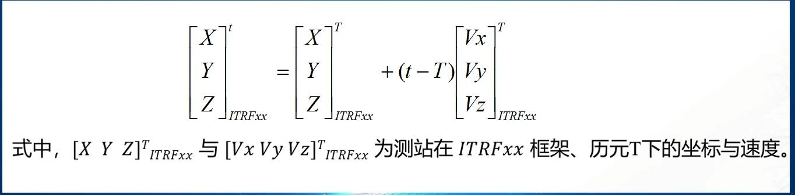
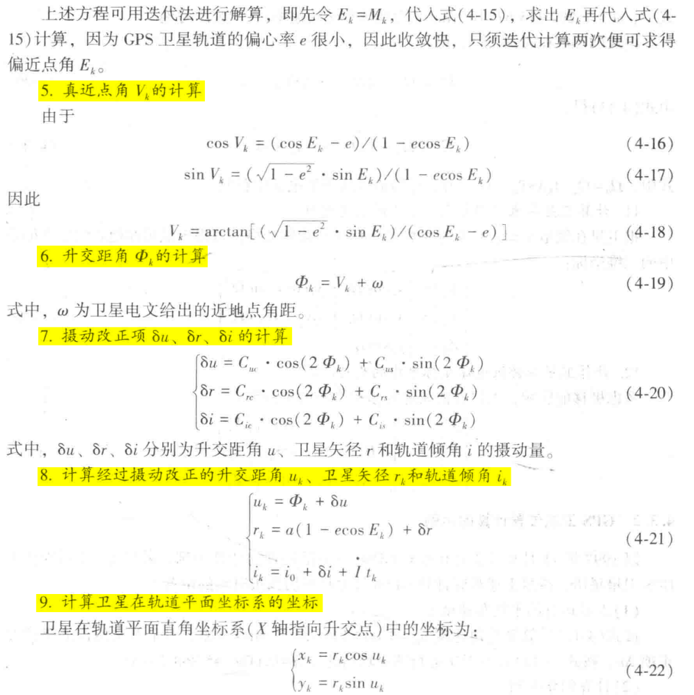
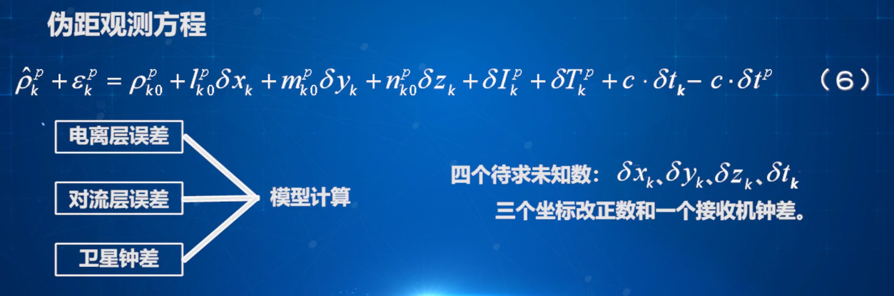
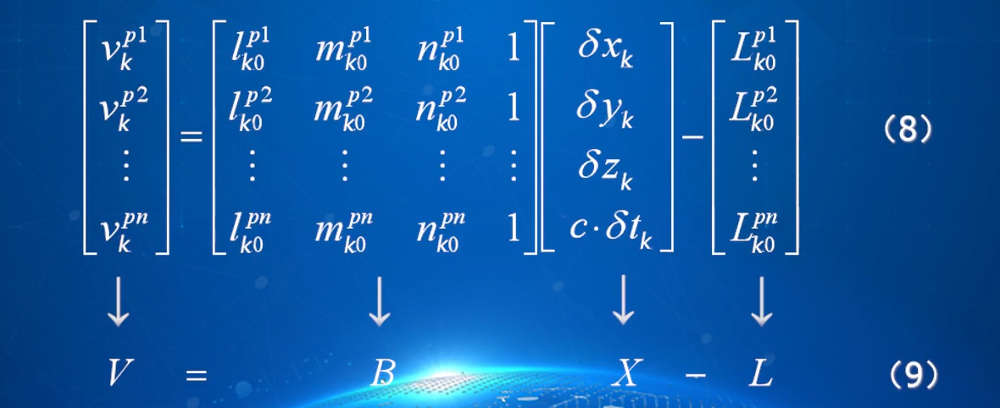
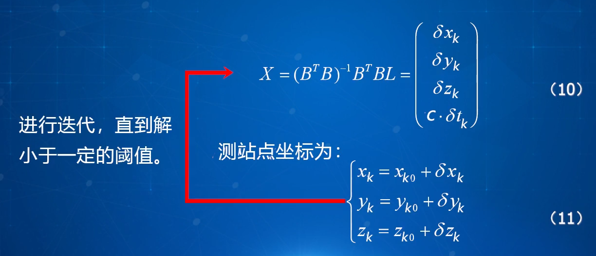

#  一、卫星导航定位系统简介

##  1.1 GNSS简单介绍及分类

==GNSS代表全球导航卫星系统（Global Navigation Satellite System），是由一组卫星和地面接收器组成的系统，用于提供全球范围内的位置、导航和定时服务。GNSS系统利用卫星发射的信号，由地面接收器接收并进行处理，从而确定接收器的准确位置。==

目前，有几个主要的GNSS系统可供使用：

1. **GPS（全球定位系统）**：由美国国防部开发，是最早和最广泛使用的GNSS系统。GPS系统由一组24颗卫星组成，可以提供全球覆盖的位置和导航服务。

2. **GLONASS（格洛纳斯）**：由俄罗斯开发和维护的GNSS系统。GLONASS系统由一组约30颗卫星组成，提供全球覆盖的位置和导航服务。

3. **Galileo（伽利略）**：由欧洲航天局（ESA）和欧盟共同开发的GNSS系统。Galileo系统正在逐步建设中，预计将包含约30颗卫星，旨在提供更高的定位精度和服务可用性。

4. **BeiDou（北斗导航卫星系统）**：由中国国家航天局开发的GNSS系统。BeiDou系统由一组约30颗卫星组成，提供亚太地区的全球导航覆盖。

**这些GNSS系统都基于类似的原理工作，即通过卫星发射信号，由接收器接收并计算出准确的位置信息。使用GNSS系统**，人们可以在航海、航空、车辆导航、移动通信、测绘等各种应用中获得准确的位置和导航数据。同时，通过将不同GNSS系统的信号进行组合和处理，可以进一步提高定位的准确性和可靠性。

##  1.2 GPS由来及系统组成

GPS是全球定位系统（Global Positioning System）的缩写，它由美国国防部（Department of Defense）开发并维护。下面是GPS的来历和系统组成的简要介绍：

**GPS的来历**：
GPS最初是在1970年代由美国国防部为了满足军事需求而开发的。当时，美国军方需要一种精确的全球定位和导航系统，以便在任何地点和任何时间获取准确的位置信息。最初的GPS系统仅供军事使用。

随着时间的推移，GPS的应用范围扩大到了民用领域。在1983年，美国政府宣布对民用用户开放GPS信号，这使得GPS技术得以广泛应用于民用导航、测绘、航空、航海和其他相关领域。

**GPS系统组成**：

1. **空间GPS卫星星座**：GPS系统由一组约30颗工作卫星组成，这些卫星以高度固定的轨道绕地球运行。这些卫星被平均分布在6个轨道面上，每个轨道面上通常有4-5颗卫星。
2. **地面监控系统**：GPS系统的控制段由位于地面上的控制站组成。控制站负责监测卫星状态、计算卫星轨道参数、时钟校准和系统卫星排程等任务。它们与卫星进行通信，确保卫星系统运行正常并提供准确的位置信息。
3. **用户GPS信号接收机**：用户段包括使用GPS接收器的个人、车辆、船舶、飞机等。GPS接收器是将来自卫星的信号接收并计算出位置的设备。现代的GPS接收器通常具有高精度、实时导航、多频段接收等功能，以满足各种应用需求。

**工作原理**：
**GPS接收器接收来自卫星的信号，其中包含有关卫星的信息和时间标记。通过同时接收多颗卫星的信号，并利用卫星传输的时间标记，GPS接收器可以计算出自身与每颗卫星之间的距离。**通过与至少4颗卫星的距离计算，GPS接收器能够确定自己的准确位置。根据三角公式计算可以得到接收机的位置，**三颗卫星可进行2D定位（经度、纬度），四颗卫星则可进行3D定位（经度、纬度及高度）**。

需要注意的是，GPS的定位精度受到多种因素的影响，如信号遮挡、大气干扰、接收器性能等。为了提高精度和可靠性，==**通常采用差分GPS（DGPS）或实时动态差分（RTK）等技术进行精确定位**==。

## 1.3 北斗卫星导航系统组成及特点

北斗卫星导航系统（BeiDou Navigation Satellite System）是由中国国家航天局开发和维护的全球导航卫星系统。下面是北斗系统的组成和一些特点的简要介绍：

**北斗卫星导航系统的组成**：

1. 空间段：北斗系统由一组工作卫星组成，这些卫星分布在地球轨道上，提供全球导航覆盖。目前，北斗系统主要由地球同步轨道卫星（GEO）、倾斜地球同步轨道卫星（IGSO）和中圆地球轨道卫星（MEO）组成。

2. 控制段：控制段负责卫星轨道管理、时钟控制、卫星状态监测和系统维护等任务。中国的北斗控制段由多个地面测控站和处理中心组成。

3. 用户段：用户段包括使用北斗系统的个人、车辆、船舶、航空器以及其他设备和应用。用户可以通过北斗接收器接收卫星信号，并利用北斗系统提供的导航和定位服务。

**北斗卫星导航系统的特点**：

1. 全球覆盖：北斗系统旨在提供全球覆盖的导航和定位服务。它的卫星分布在不同轨道上，可以覆盖全球范围，包括陆地、海洋和空中。

2. 多系统兼容：北斗系统兼容其他主要的全球导航卫星系统，如GPS、GLONASS和Galileo。这意味着北斗接收器可以接收和处理来自多个系统的卫星信号，提供更可靠、准确的导航和定位服务。

3. 高精度：北斗系统具有较高的定位精度，可以提供亚米级的位置测量。通过使用差分定位等技术，北斗系统的精度可以进一步提高。

4. 高可用性：北斗系统采用多卫星、多频段和多路径技术，以增加信号的可用性和稳定性。这使得北斗系统在恶劣环境下（如城市峡谷和浓密林地）也能提供较好的导航和定位性能。

5. 多种应用：北斗系统广泛应用于交通运输、航海、航空、测绘、农业、电力、公共安全等领域。它可以用于车辆导航、船舶定位、航空导航、精准农业等多种应用场景。

总体而言，北斗卫星导航系统是中国自主研发的全球导航卫星系统，具有全球覆盖、高精度、多系统兼容和多种应用的特点，为用户提供准确可靠的导航和定位服务。

## 1.4 GLONASS与GALILEO简介及各GNSS系统的比较

GLONASS（格洛纳斯）和Galileo（伽利略）是两个与GPS类似的全球导航卫星系统。下面是对GLONASS、Galileo和GPS的简介以及它们之间的比较：

GLONASS（格洛纳斯）：
GLONASS是由俄罗斯开发和维护的全球导航卫星系统。它由一组约30颗卫星组成，以提供全球覆盖的导航和定位服务。GLONASS的定位精度和可靠性与GPS相当，被广泛应用于俄罗斯和其他地区的导航和定位领域。

Galileo（伽利略）：
Galileo是由欧洲航天局（ESA）和欧盟共同开发和维护的全球导航卫星系统。它是一个逐步建设的系统，预计将包含约30颗卫星，提供全球覆盖的导航和定位服务。Galileo的设计目标是提供更高的定位精度和服务可用性，同时与其他GNSS系统兼容。

GPS（全球定位系统）：
GPS是由美国国防部开发和维护的全球导航卫星系统。它由一组约30颗卫星组成，提供全球覆盖的导航和定位服务。GPS是最早和最广泛使用的GNSS系统，具有成熟的技术和广泛的应用领域。

GNSS系统比较：
==**下面是GLONASS（格洛纳斯）、Galileo（伽利略）、GPS（全球定位系统）和BDS（北斗导航卫星系统）之间的比较**==：

1. ==卫星数量==：
   - GPS：约30颗卫星
   - GLONASS：约30颗卫星
   - Galileo：预计约30颗卫星（建设中）
   - BDS：约30颗卫星

2. 系统覆盖：
   - GPS、GLONASS、Galileo和BDS都提供全球覆盖的导航和定位服务。

3. 精度：
   - GPS：在标准条件下提供约==5-10米==的定位精度。使用差分GPS或RTK技术可以提高精度至几厘米。
   - GLONASS：在标准条件下提供约==5-10米==的定位精度。使用差分GLONASS或RTK技术可以提高精度至几厘米。
   - Galileo：在标准条件下预计提供约==1-1.5米==的定位精度。使用差分Galileo或RTK技术可以进一步提高精度。
   - BDS：在标准条件下提供约==10米==的定位精度。使用差分BDS或RTK技术可以提高精度至几厘米。

4. 兼容性：
   - GPS、GLONASS、Galileo和BDS具有相互兼容的能力，可以通过多系统接收器同时接收和处理多个系统的卫星信号，提供更可靠、准确的导航和定位服务。

5. 应用领域：
   - GPS：广泛应用于全球的交通、航海、航空、农业、测绘等领域。
   - GLONASS：在俄罗斯及其周边地区广泛应用于导航和定位领域。
   - Galileo：作为欧洲独立的导航卫星系统，逐渐在全球范围内得到应用，可用于各种导航、定位和时序应用。
   - BDS：主要应用于中国和亚太地区的导航和定位领域，包括交通、农业、测绘等。

总体而言，GPS、GLONASS、Galileo和BDS是几个主要的全球导航卫星系统，它们在卫星数量、定位精度、兼容性和应用领域等方面存在一些差异，用户可以根据具体需求和地理位置选择合适的系统来进行导航和定位。同时，多系统接收器可以同时接收和处理多个系统的信号，以提供更可靠、准确的导航和定位服务。

## 1.5 GNSS的主要特点及其应用

GNSS（全球导航卫星系统）是一种利用卫星信号进行导航和定位的技术系统。它的主要特点包括：

1. 全球覆盖：GNSS系统设计用于在全球范围内提供导航和定位服务。通过卫星在不同轨道上的分布，GNSS可以实现全球覆盖，无论是陆地、海洋还是空中，用户都可以接收到卫星信号。

2. **多卫星系统**：GNSS由多个独立的卫星系统组成，如GPS、GLONASS、Galileo和BDS等。这些系统的卫星分布在不同的轨道上，提供多个卫星信号源，增加了信号的可靠性和准确性。

3. **多频段信号**：GNSS系统提供多个频段的信号，例如L1、L2和L5频段。不同频段的信号具有不同的特性和用途，可以用于提高定位精度、减少多径效应等。

4. **高精度定位**：GNSS系统可以提供从米级到亚米级的定位精度。通过使用差分定位技术、RTK（实时动态定位）等方法，可以进一步提高定位的精度，满足高精度定位的需求。

5. 实时性：GNSS系统能够提供实时的导航和定位服务。用户可以通过接收卫星信号来实时获取位置、速度和时间等信息，支持实时导航、车辆追踪、航空导航等应用。

GNSS的应用非常广泛，包括但不限于以下领域：

1. 交通和车辆导航：GNSS用于车辆导航系统、交通管理和车队管理，帮助驾驶员确定最佳路线、提供交通信息和导航指引。

2. 航空和航海导航：GNSS在航空器和船舶中广泛应用，用于导航、位置报告和飞行管理，提供精确的定位和导航服务。

3. 测绘和地理信息系统（GIS）：GNSS用于测绘、地图制作和地理信息系统，提供准确的地理数据和位置信息。

4. 农业和精准农业：GNSS在农业领域中用于精准农业管理、农作物种植和施肥等操作，提高农业生产效率和资源利用率。

5. 天文学和科学研究：GNSS在天文学和科学研究中用于测量地球运动、地壳变形、大气层研究等

## 1.6 GNSS未来发展的趋势

GNSS（全球导航卫星系统）未来发展的趋势包括以下几个方面：

1. **多系统兼容性**：未来的GNSS系统将更加注重多系统的兼容性和互操作性。不同国家和地区的GNSS系统将更紧密地协作和互联，以提供更强大、可靠的导航和定位服务。

2. **高精度和增强定位能力**：随着技术的进步和创新，未来的GNSS系统将不断提高定位精度和增强定位能力。通过使用多频段信号、差分定位、RTK技术和增强现实等方法，将实现更高精度、更可靠的定位。

3. 室内定位和城市环境下的导航：室内定位和城市环境下的导航是未来GNSS发展的重点方向之一。通过结合GNSS和其他定位技术（如室内定位系统、蓝牙定位等），将实现在室内和城市峡谷等信号受限环境下的精确定位和导航。

4. **增强导航服务**：未来的GNSS系统将提供更多的增强导航服务，如增强现实导航、交通流量预测、智能交通管理等。这将提高用户体验，支持更多智能交通和导航应用的发展。

5. 空间交通管理和卫星导航增容：随着太空经济和卫星数量的增加，未来的GNSS系统将更加关注空间交通管理和卫星导航增容。这包括更好地管理卫星轨道、防止碰撞，以及提高系统容量和信号覆盖能力。

6. 安全和防护性能：未来的GNSS系统将加强安全和防护性能，以应对恶意干扰和攻击。这将包括抵御GPS冒名顶替、干扰和伪装攻击，并采取措施保障系统的安全性和可靠性。

综上所述，未来的GNSS发展将在多系统兼容性、高精度定位、室内定位、增强导航服务、空间交通管理和安全性等方面取得进一步的突破和创新。这将使GNSS在更广泛的应用领域发挥重要作用，为用户提供更准确、可靠的导航和定位服务。

#  二、卫星大地测量基础

## 2.1 坐标系统相关概念

在地理信息系统（GIS）和导航领域中，坐标系统是用来确定地球上特定位置的一种系统。以下是与坐标系统相关的一些概念：

1. **地球坐标系统**（Geographic Coordinate System，GCS）：地球坐标系统是一种基于球面地球模型的坐标系统。**它使用经度（longitude）和纬度（latitude）来确定地球上的位置**。常见的地球坐标系统包括WGS84（全球标准）、NAD83（北美标准）等。

2. 投影坐标系统（Projected Coordinate System）：投影坐标系统是将地球表面的经纬度坐标投影到平面上的坐标系统。由于地球是一个椭球体，将其展平到平面上会导致形状和距离的变形。投影坐标系统使用投影方法来减小形状和距离的变形，并提供在平面上测量距离和面积的能力。常见的投影坐标系统有UTM投影、墨卡托投影等。

3. **坐标单位**：坐标系统中的位置通常使用特定的单位表示。**经度通常以度（°）为单位表示，纬度也以度（°）为单位表示**。在投影坐标系统中，坐标单位可能是米、英尺、千米等。

4. **坐标原点**：坐标系统中的原点是用来定义坐标系统中所有位置的参考点。原点的选择可能因坐标系统的不同而不同。**一般选择地心为原点**

5. 地面高程：除了经度和纬度，有时还需要考虑地面高程（elevation）来完整描述地点的位置。地面高程可以使用海拔高度、大地水准面或其他高程系统来表示。

6. **坐标转换**：在不同的坐标系统之间进行转换是常见的需求。坐标转换是将一个坐标系统中的位置转换为另一个坐标系统中的位置。这可以通过使用坐标转换参数或数学转换公式来实现。

7. 数据地理参考系（Datum）：地理数据通常与特定的数据地理参考系相关联。数据地理参考系定义了数据中使用的坐标系统、基准点和椭球体模型。常见的数据地理参考系包括WGS84、NAD83等。

这些概念涉及到坐标系统的不同方面，对于正确解释和表示地理位置是非常重要的。在使用和处理地理数据时，了解和正确应用适当的坐标系统是至关重要的。

##  2.2 天球坐标系

天球是指在观测者地球上看到的天空，它是一个虚拟的球面，将地球包围在内。在天球上，所有的恒星、行星和其他天体看起来都在球面上移动，而观测者位于球心。
**==天球坐标系定义==：**

- 天球坐标系坐标原点O在地心
- Z轴与地球自转轴重合
- X轴指向春分点
- Y轴为右手系即右手除大拇指外的四指由X轴握向Y轴时，大拇指指向与Z轴重合
- 天轴：地球自转轴的延伸线
- 天极（NS）：天轴与天球的交点
- 天球子午面：含天轴，并过天球上任意一点的平面。
- 天球赤道面：通过地球质心，与天轴垂直的平面。
- 黄道：地球公转的轨道面与天球相交的大圆，也可以说，地球公转时，地球上的观测者看到太阳在天球上的轨道。
- 春分点：太阳在黄道上，从天球的南半球向北半球运动时，黄道与赤道面的交点。

 天球坐标系不随地球自转而运动。
**==天球坐标系的表达方式：==**
天球球面坐标系（赤经α，赤纬δ，向径r），天球空间直角坐标系（X，Y，Z）。
两者的换算关系如图 

## 2.3 地球坐标系与大地坐标系

地球坐标和大地坐标是用于描述地球上特定位置的两种不同的坐标系统。

### **2.3.1 地球坐标**

**==坐标系定义：==**

- 大地坐标系坐标原点O在地心
- Z轴与地球自转轴重合
- X轴指向过格林尼治子午面与赤道面交点
- Y轴为右手系。

### 2.3.2 大地坐标

大地坐标系统： 大地坐标系随地球自转而运动 

**==大地坐标系的表达方式==**：
**大地坐标（纬度B，经度L，大地高H），直角坐标（X，Y，Z）。**
大地坐标正算到空间直角坐标， N为该点的卯酉圈曲率半径 ， e为椭球第一偏心率 

 空间直角坐标反算到大地坐标 

大地坐标系统在测量和地理信息系统（GIS）应用中非常重要。它用于确定地球上特定点的精确位置，包括测量和绘制地图、地理空间分析、地形建模等。大地坐标系统还包括一些参数和参考模型，如大地基准面和大地水准面，用于更准确地描述地球的形状和曲率。

总而言之，地球坐标系统是使用经度和纬度描述地球上位置的二维坐标系统，而**大地坐标系统是包括经度、纬度和高程在内的三维坐标系统，考虑了地球的椭球形状和地球表面的海拔变化**。

## 2.4 WGS-84坐标系和我国大地坐标系

### 2.4.1 WGS-84坐标系

**WGS-84（World Geodetic System 1984）是一种地理坐标系统，用于描述地球上的位置和坐标。它是由美国国防部国家地理空间情报局（National Geospatial-Intelligence Agency，简称NGA）开发的，并于1984年发布。**WGS-84坐标系统是全球标准的地球坐标系统之一，被广泛用于导航、测量、地图制作和全球定位系统（GPS）等应用中。

WGS-84坐标系统使用经度（Longitude）和纬度（Latitude）来确定地球上的位置。经度表示东西方向上的位置，以本初子午线（0度经度）为基准，向东为正值，向西为负值，范围从-180度到+180度。纬度表示南北方向上的位置，以赤道为基准，向北为正值，向南为负值，范围从-90度到+90度。

**==坐标系定义（属于地球坐标系）==**

- 原点O位于地球质心
- Z轴指向BIH1984.0定义的协议地球极（CTP)方向
- X轴指向BIH1984.0定义的零子午面和CTP赤道的交点
- Y轴与Z、X轴垂直并构成右手坐标系

### 2.4.2 CGCS2000国家大地坐标系

**CGCS2000（China Geodetic Coordinate System 2000）是中国国家大地坐标系的名称。它是中国国家测绘局于2000年制定的一种地理坐标系统，用于描述中国国土上的位置和坐标。**

CGCS2000国家大地坐标系采用了WGS-84（World Geodetic System 1984）作为基准椭球体，并在此基础上对中国境内的地理坐标进行了精确的测量和转换。它与WGS-84之间存在一定的差异，主要是由于地球形状和重力场的差异以及对中国地区的精确测量数据的考虑。

**==坐标系定义==**

- 原点为地球的质心
- Z轴指向国际地球旋转服务机构IERS定义的香春极IRP方向
- X轴指向IERS定义的春子午面(IRM)与地球赤道面的交线
- Y轴与Z、X轴垂直，构成右手坐标系

## 2.5坐标之间的转换

### 2.5.1 布尔萨模型（七参数模型）

3个平移参数，3个旋转参数，1个尺度参数。如果参数未知，可通过两套坐标系统下至少三个重合点的坐标，采用间接平差，求得转换七参数。 

**转换过程**：间接平差——>转换七参数——>地方目标坐标系中的坐标

### 2.5.2 ITRF框架之间的转换

**ITRF介绍：** ITRF（International Terrestrial Reference Frame）是一系列的地球参考框架，用于描述地球表面的位置和运动。**ITRF框架的目的是提供全球一致的地理坐标系统**，以支持测量、地球科学研究、导航和定位等应用。 

**两种ITRF框架之间的转换方式**：
`一是先历元后框架`，**即先进行同一框架下不同历元之间的转换，再进行不同框架之间的相互转换**。
`二是先框架后历元`，**即先进行不同框架之间的相互转换，再进行同一框架之下的不同历元之间的转换**。
转换需要的14个参数可在IGS官网上查询。
同一框架下不同历元之间的转换，采用如下公式。

同一历元下不同框架之间的转换，采用如下公式

根据IERS发布的14个参数,即可计算出利用同一历元下转换参数的七参数,可以用最下面这个公式来进行计算。

## 2.6 时间系统

- **恒星时**：以春分点为参照点的时间系统。（具有地方性）
- 平太阳时：以平太阳为参照点的时间系统。（具有地方性）
- 世界时：平子夜为零时的格林尼治平太阳时。
- **原子时**：以物质内部原子运动周期为基础。
- 协调世界时：以原子时秒长的世界时（跳秒）。
- **GPS时间系统**：秒长为原子时， 时间起算点为1980年1月6日UTC 0时， 启动后不跳秒， 时间连续。
- **北斗时间系统**：北斗时间系统BDT以原子时作为秒长,由国家授时中心进行时间维持。时间起算点为2006年1月1日UTC 0时。

原子时=GPS时+19s(这个19s是1958年到1980年，UTC的跳秒是19s)

**各GNSS系统的时间系统与原子时ATI的关系:**

# 三、卫星运动基础及GNSS卫星星历

## 3.1 无摄运动(二体问题)

卫星的无摄运动是指卫星在地球轨道上的运动，不受外力作用而保持一定的运动状态。这种运动是在理想条件下，假设**只有地球的引力对卫星产生作用，并忽略其他外力的影响**。

根据牛顿的引力定律，卫星绕地球的轨道上运动时，地球对卫星的引力提供了向心力，使得卫星能够保持在轨道上运动。**在无摄运动的情况下，卫星的轨道是一个稳定的椭圆或圆形轨道**。

无摄运动的卫星具有以下==特点==：

1. **定常速度**：在无摄运动下，卫星绕地球的轨道上运动的速度是恒定的，且与卫星所处的轨道半径有关。根据开普勒定律，离地球较远的轨道速度较慢，而离地球较近的轨道速度较快。

2. **周期性运动**：卫星的无摄运动是周期性的，即卫星绕地球完成一次轨道运动所需的时间是恒定的，称为轨道周期。轨道周期取决于卫星的高度和地球的质量。

3. **保持轨道稳定性**：在无摄运动下，卫星会保持在给定的轨道上运动，以维持与地球之间的引力平衡。**任何摄动或干扰力的作用都可能使得卫星离开原始轨道，因此需要精确的轨道控制和修正来维持轨道稳定性**。

需要注意的是，实际上，在卫星运行过程中会受到多种外力的影响，如太阳引力、月球引力、大气阻力等。**这些外力的存在会导致卫星轨道产生微小的变化和漂移**，因此，在实际应用中，需要进行轨道校正和调整，以保持卫星的轨道精度和稳定性。

## 3.2 受摄运动

卫星的受摄运动是指卫星在地球轨道上的运动，除了地球引力外，还受到其他外力的作用。这些外力可以包括太阳引力、月球引力、大气阻力、地球形状不规则等。

下面是一些常见的受摄运动的情况：

1. 太阳引力：太阳对卫星的引力会对其轨道产生扰动。太阳引力会使卫星的轨道发生周期性的变化，导致轨道离心率和倾角的周期性变化。
2. 月球引力：月球对卫星的引力同样会对轨道产生扰动。尤其是在卫星距离地球较近的轨道上，月球引力对轨道的影响较为显著。
3. 大气阻力：在较低的轨道高度上，大气层的稀薄气体会对卫星产生阻力，导致轨道逐渐衰减。这需要通过推进剂消耗来补偿轨道高度的损失。
4. 地球形状不规则：地球并不是完全规则的球体，其形状存在微小的不规则性。这些不规则性会对卫星的轨道产生影响，导致轨道的周期性变化。

## 3.3 轨道根数

**开普勒三大定律**

- 第一定律即“轨道定律”：所有的行星分别在不同的椭圆轨道上围绕太阳运动,**太阳处在这些椭圆的一个焦点上**。
- 第二定律即“面积定律”：对每个行星而言， 行星和太阳的连线在**任意相等的时间内扫过的面积都相等(**“面积速度”不变)。
- 第三定律即 “周期定律”：所有行星的椭圆轨道的长半轴的三次方跟公转周期的二次方的比值都相等。

**确定卫星在其轨道平面上的位置的==三个==参数：**

**确定卫星椭圆轨道平面在==空间中==的位置的三个参数:**

- 1、升交点与春分点间的地心角度Ω。
- 2、轨道的倾角i,它是卫星椭圆轨道中面与地球赤值面所夹的角度。
- 3、近地点的角距w，它是轨道平面上近地点与升交点之间的地心角距。

**==以上a e V Ω i ω 也叫做开普勒轨道数或者叫做轨道根数。==**

## 3.4 IGS简介

 IGS代表国际GNSS服务（International GNSS Service），它是一个全球性的组织，**提供全球导航卫星系统（GNSS）数据、产品和服务，支持精确的测量、定位和导航应用**。

IGS的主要任务包括以下几个方面：

1. GNSS观测数据收集和分发：IGS通过全球的GNSS测站网络收集观测数据，包括来自GPS（全球定位系统）、GLONASS（俄罗斯的全球导航卫星系统）、Galileo（欧洲的全球导航卫星系统）和其他GNSS系统的数据。这些观测数据经过处理和分析后，以标准格式发布，供全球用户下载和使用。

2. **精密星历和钟差产品生成**：IGS利用收集到的观测数据，通过精确的数据处理和分析方法，生成高精度的星历和钟差产品。这些产品包括卫星的位置、速度信息（星历）以及卫星钟差数据，可用于定位、导航和科学研究等应用。

   

3. **参考框架维护和转换**：**IGS维护国际参考框架**（International Terrestrial Reference Frame，ITRF），通过观测数据和精密的数据处理技术，提供全球一致的参考框架。IGS还提供参考框架之间的转换参数，用于将不同参考框架之间的测量结果进行转换和比较。

4. GNSS数据分析和科学研究：IGS的观测数据和产品可用于广泛的科学研究领域，包括地球动力学、大气科学、地壳运动、海洋学等。通过对GNSS数据的分析，可以研究地球的形状、引力场变化、板块运动、大气层变化等重要现象。

IGS是一个由多个国家和机构共同参与的国际合作组织。通过共享数据、经验和技术，IGS致力于提供高质量的GNSS数据和产品，推动全球导航和测量科学的发展。

## 3.4 卫星星历

**卫星星历（Satellite Ephemeris）是指描述卫星在空间中的位置和运动状态的数据。星历提供了卫星的轨道参数和位置信息，用于定位、导航和定时等应用**。

卫星星历包括以下内容：

- 卫星标识：每颗卫星都有唯一的标识符，用于区分不同的卫星。
- 时刻信息：星历数据会提供卫星位置和运动状态的时刻信息，通常以UTC（协调世界时）或GPS时间表示。
- 轨道参数：星历包括了描述卫星轨道的参数，如半长轴、偏心率、倾角、升交点赤经、近地点参数等。这些参数描述了卫星在空间中的轨道形状和方向。
- 卫星位置：星历数据提供了卫星在特定时刻的位置坐标信息，通常以地心惯性坐标系（ECI）或地心地固坐标系（ECEF）表示。

星历数据由卫星导航系统（如GPS、GLONASS、Galileo等）的控制中心或测控站通过精密的测量和计算获得，并以预定义的时间间隔（通常为几秒或几分钟）发布。==**用户可以通过接收和解码星历数据，来获取卫星的实时位置和轨道状态，以实现精确的定位和导航。**==

**广播星历参数如下：**

需要注意的是，星历数据的精度对于定位和导航的准确性非常重要。卫星导航系统会不断更新和改进星历数据，以提供更精确的位置和时间信息。用户在进行定位和导航应用时，应使用最新的星历数据，并考虑误差和数据更新频率，以确保获得准确的定位结果。

#  四、GNSS卫星信号

## 4.1 概述

GNSS卫星信号是通过无线电波传播的。每个GNSS系统都由一组卫星组成，这些卫星在高度约20,000公里的轨道上运行。卫星发射的信号包含有关卫星自身位置和时间的信息，以及用于计算接收器位置的数据。

GNSS信号主要分为两个类型：**导航信号和辅助信号**。

- 导航信号是用于定位和导航的主要信号。它们包含有关卫星的精确位置、时间和导航信息。导航信号是由GNSS卫星以特定的频率和编码格式发射的。

- 辅助信号是一些附加的信号，用于帮助接收器更好地接收和处理导航信号。这些信号包括天线位置校准信号、

   时钟校准信号和其他辅助信息。

**信号调制过程**：导航电文先调制在测距码上得到组合码，组合码（导航电文和测距码）调制在载波上。

GPS卫星星历属于导航电文，导航电文在数据码（D码）中。

导航卫星选用的频段：L波段（1-2GHz，甚高频）。

选用L波段的原因：

①占用率低（开始）②适用于扩频，宽频信息③多普勒频移大，可测速④电离层传播损失小

## 4.2 卫星信号

### 4.2.1 GPS的信号

  

GPS的信号有**测距码信号（C/A，P码）**，**导航电文（D码，数据码）**，**载波信号（L1，L2）**。

GPS采用伪随机噪声码测距技术，具有良好的抗干扰性和保密性。**GPS采用两种测距码，即C/A码和P码**。

####  C/A码(Coarse Acqusition Code)[粗码、捕捉码] 

C/A码是粗捕获码，是由两个10级反馈移位寄存器组合产生，**易于捕获，但测距精度较低**。可供码分多址系统选用。

特性(现在已经终止)：基于国家安全的考虑，美国国防部刻意以无线电讯号干扰卫星上的原子钟，并宣告一些不准确的轨道参数来造成定位误差。这即是所谓的SA (Selective Availability)效应。 

    

#### **P码**( Precise Code )  [精码 ] 

是精密测距码，P码产生的原理与C/A码相似，但更复杂。发生电路采用的是两组各由12级反馈移位寄存器构成 ，难**于捕获，易于保密。测距精度高，且无模糊度**。 

==码的捕获==一般是先捕获C/A码，再根据导航电文信息，捕获P码。由于P码的码元宽度为C/A码的1/10，若取码元对齐精度仍为码元宽度的1/100，则相应的距离误差为0.29m，故P码称为精码。采用二级调制的方法，既节省了电能，又增强了信号的抗干扰能力。

### 4.2.2 GPS测距码测距原理

**==步骤==**：

1. 卫星依据自己时钟（钟脉冲）发出某一结构的测距码，经过△ t时间传播到达GPS接收机。
2. 接收机在自己钟脉冲驱动下，产生一组结构完全相同的复制码。
3. 通过时延器使之延迟时间τ ，对两码进相关比较。
4. 直至两码完全对齐，相关系数R(t) = max ≈ 1，则该时间延迟τ即为传播时间△ t ( τ = △ t ) △t(τ=△t)△t(τ=△t)。
5. 距离ρ = c ⋅ △ t = c ⋅ τ。

## 4.3 卫星导航电文

导航电文是指包含导航信息的数据码。

==**组成**==：**卫星星历、时钟改正、电离层时延改正、工作状态信息以及由C/A码捕获P码的信息**。

这些信息是以二进制码的形式，按规定格式组成，按帧向外播送。

它的基本单位是长1500 bit的一个主帧，传输速度是50 bit/s,30s传送完一个主帧。

第1、2、3子帧各有10个字码,每个字码30bit，每30秒重复一次，内容每小时更新一次。第4、5子帧各有25个页面，共有37500 bit。第4、5子帧的全部信息则需要750秒钟才能够传送完。

## 4.4 卫星瞬时位置的计算

这里介绍用广播星历计算卫星位置

# 五、 GNSS接收机

## 5.1 GNSS接收机组成

**一、接收机天线单元**：

就是上图前置放大器模块

**二、接收机主机单元：**

1、将接收到的信号经由前置放大器放大

2、然后进入信号通道。

3、然后将信号存入存贮器。

4、信号在微处理器CPU模块附近协同处理

5、最后输出至显示器

**三、电源**

分为内电源（由ROM供电）和外电源（可充电的12V直流镍镉电池组）

## 5.2 GNSS接收机工作原理

- 1、接收机接收卫星发射的测距码并产生相同的复制码；
- 2、接收码比复制码滞后一段时间；
- 3、时延器将复制码延后（向后移位），直到与接收码对齐为止，记录延后时间，即为电磁波在星站间传播所用时间。 

## 5.3 GNSS接收机的任务

// auther:@zxl      time:2023.05.26 17.10

# 六、GNSS卫星定位基本原理

## 6.1 概述

**GPS定位基本原理**

 地面跟踪站（已知坐标点）跟踪测量至卫星的距离，计算卫星的坐标；已知卫星坐标，用户接收机测量至四颗以上卫星的距离，计算接收机位置。
GPS定位需要解决两个关键问题，卫星位置的确定，站星距离的测量。
卫星位置的确定可通过卫星星历解算，站星距离测量可采用测距码或载波相位测量。 

## 6.2 伪距测量(SPP)

卫星向地面发送的信号：数据码、测距码、载波

1、**伪距**：测得的距离含有时钟误差和大气层折射延迟，而非“真实距离”,故称伪距。

伪= 光速 乘以 测得的传播时间（有误差）

**伪距单点定位原理**

接受机和卫星生成同一串码元，卫星信号向地面发送

等卫星信号到达接收机的时候

将测距码前移，使用自相关函数判断是否对齐，如果自相关函数值很小，则需要前移测距码，直到测距码自相关函数值最大，近似为1，该码元差即为A、B信号的距离， 此时的时间平移量称为码元差MPK ，可由此测信号传播时间。

测得的传播时间即，码源差 = 真实传播时间 + 地面接收器的时间误差 - 卫星时钟时间误差，测得的信号传播时间与真实传播时间有式子(2)之间的误差，给式(2)乘以光速c，则得出式(3)

因为真实传播时间有一系列误差存在，所以可以将式(3)分解成3项

伪距= 光速 乘以 测得的传播时间（有误差（tk-tk））式子3

伪距 = 星地几何距离+电离层误差 + 对流层误差 + c（tk-tk）式子4

卫星坐标可以通过卫星传播来的数据码提供的轨道参数可以求得卫星坐标(Xp，Yp，Zp)

在测站近似坐标处，进行泰勒展开

同时观测到n个卫星，可以将式7变成式8的矩阵形式，符号化成式9

目的就是定位测站的位置坐标（Xk，Yk，Zk），为三个未知待求项

设卫星的位置坐标为（Xs，Ys，Zs），可有卫星电报得到，已知项

电离层，对流层，卫星时钟tp误差可通过其他模型求出，为已知项

观测站时钟误差tk为未知项

一共有四个位置项X Y Z tk

找到四个卫星，利用下面方程进行联立求解

  

#6.3 载波相对定位